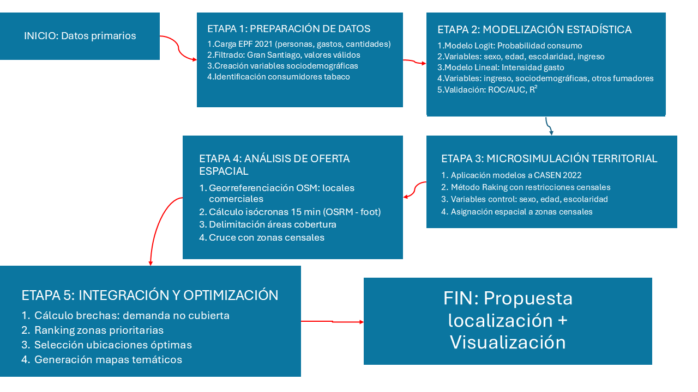

```{r Setup directorio, message=FALSE, warning=FALSE, include=FALSE}
knitr::opts_knit$set(root.dir = rprojroot::find_rstudio_root_file())
setwd("C:/Users/felip/Escritorio/U/2025_2s/Geomarketing/Repositorio/Geomarketing_2s_2025/") 
file.exists("data/casen_rm.rds")      # debe devolver TRUE
file.exists("data/cons_censo_df.rds") # debe devolver TRUE
# Se realizo este proceso, debido a un error en el directorio de trabajo en donde este estaba seteado en la carpeta T2 por lo que arrojaba errores al ejecutar la conexión con las Bases de datos en formato .rds
```

# 1 - Introducción

El mercado tabaquero chileno presenta características únicas que combinan una demanda relativamente inelástica con una oferta fuertemente regulada. Con una prevalencia de consumo que afecta a aproximadamente un tercio de la población adulta (MINSAL, 2021), el gasto en productos de tabaco representa un flujo económico significativo que supera los USD 2.000 millones anuales. Sin embargo, la distribución espacial de los puntos de venta y su adecuación a los patrones de demanda reales permanece como un área poco explorada en la literatura especializada.

Esta investigación surge ante la necesidad de desarrollar herramientas analíticas que permitan optimizar la localización de puntos de venta de tabaco en el Gran Santiago, integrando por primera vez modelos econométricos de demanda individual con análisis espacial avanzado de la oferta existente. El estudio se fundamenta en la hipótesis de que existen brechas significativas entre la distribución actual de los locales comerciales y la demanda potencial, generando oportunidades de mercado no explotadas y problemas de accesibilidad en ciertas zonas urbanas.

Desde una perspectiva teórica, el trabajo se enmarca en los modelos de localización retail (Christaller, 1933; Lösch, 1954) y en la economía espacial contemporánea, aplicando conceptos de accesibilidad, externalidades de aglomeración y análisis de cobertura mediante isócronas. Metodológicamente, se implementa un enfoque en dos etapas: primero, se estima la probabilidad de consumo y el gasto esperado mediante modelos logit y de regresión aplicados a la Encuesta de Presupuestos Familiares (EPF); segundo, se realiza microsimulación espacial para expandir estos resultados a nivel poblacional usando datos del Censo y CASEN, integrando finalmente con información de oferta proveniente de OpenStreetMap.

La relevancia de esta investigación es triple: (1) académica, al integrar métodos de microsimulación con análisis SIG en un contexto de producto regulado; (2) empresarial, proporcionando herramientas de geomarketing para optimización de redes de distribución; y (3) de política pública, ofreciendo evidencia para la regulación inteligente de puntos de venta. El estudio se concentra en el Gran Santiago por ser el principal mercado metropolitano del país, analizando 34 comunas que concentran aproximadamente el 40% de la población nacional.

El trabajo se estructura en seis secciones principales. Tras esta introducción, la sección 2 presenta el marco teórico y los antecedentes empíricos. La sección 3 detalla la metodología y las fuentes de datos. Las secciones 4 y 5 presentan respectivamente los análisis de demanda y oferta. La sección 6 integra ambos enfoques para proponer localizaciones óptimas, finalizando con conclusiones y recomendaciones en la sección 7.

A través de este análisis multidimensional, se busca no solo identificar oportunidades comerciales específicas, sino también contribuir a un entendimiento más sofisticado de las dinámicas espaciales que caracterizan los mercados de productos regulados en contextos urbanos complejos.

## 1.1 - Objetivo General

Determinar localizaciones óptimas para la expansión de la oferta comercial de conveniencia en el Gran Santiago, mediante la integración de modelos de microsimulación de demanda y análisis de accesibilidad espacial, bajo el enfoque de planificación urbana de la "Ciudad de 15 Minutos".

## 1.2 - Objetivos Específicos

-   Estimar la demanda potencial de gasto mensual en bienes de conveniencia a nivel de zona censal, utilizando técnicas de microsimulación (Raking) aplicadas a los datos de la IX Encuesta de Presupuestos Familiares (EPF).

-   Mapear la oferta comercial actual en el área de estudio, procesando datos georreferenciados de OpenStreetMap para identificar supermercados, almacenes y locales de conveniencia.

-   Evaluar la accesibilidad peatonal mediante el cálculo de isócronas de 15 minutos de caminata utilizando el motor OSRM, permitiendo definir el área de influencia real de los locales existentes.

-   Identificar brechas territoriales de consumo, cruzando los datos de demanda simulada con las áreas de cobertura para cuantificar el gasto potencial no captado en zonas desatendidas.

-   Proponer localizaciones estratégicas basadas en un modelo de optimización que maximice la captura de la demanda insatisfecha.

------------------------------------------------------------------------

# 2 - Marco Metodológico

## 2.1 - Diseño del estudio / Proceso analítico (diagrama de flujo)

La investigación sigue un diseño secuencial y multimétodo que integra análisis estadísticos, espaciales y de simulación en cinco etapas articuladas:

### Diagrama de flujo del proceso analítico:



Este diseño permite la transición coherente desde datos microeconómicos individuales hasta recomendaciones espaciales específicas, manteniendo validación estadística en cada etapa.

## 2.2 - Fuentes de datos

| Fuente | Año | Contenido | Uso en estudio | Unidad análisis |
|:---|:---|:---|:---|:---|
| **EPF** | 2021 | Gastos, cantidades, características hogares | Modelización comportamiento consumo | Individuo |
| **CASEN** | 2022 | Características sociodemográficas población | Expansión modelos a población | Individuo |
| **Censo** | 2017 | Conteos poblacionales por variables clave | Restricciones microsimulación | Zona censal |
| **OpenStreetMap** | 2024 | Puntos de interés, red vial | Georreferenciación oferta comercial | Punto/Polígono |
| **PostgreSQL/PostGIS** | \- | Zonas censales urbanas | Unidad espacial análisis | Zona censal |
| **OSRM API** | \- | Cálculo rutas peatonales | Generación isócronas | Área de influencia |

**Cobertura espacial:** 34 comunas del Gran Santiago, representando \~40% población nacional.

**Criterios de inclusión:**

-   Población ≥ 15 años (edad legal consumo)

-   Áreas urbanas consolidadas

-   Ingresos válidos reportados

## 2.3 - Métodos estadísticos

### 2.3.1 Modelización de participación (Modelo Logit)

$P(Y_i=1) = \frac{e^{\beta_0 + \beta_1X_1 + ... + \beta_kX_k}}{1 + e^{\beta_0 + \beta_1X_1 + ... + \beta_kX_k}}$$$

**Variables predictoras:**

-   X₁: Sexo (factor)

-   X₂: Edad (continua)

-   X₃: Escolaridad (ordinal)

-   X₄: Ingreso per cápita logarítmico

### 2.3.2 Modelización de intensidad (Modelo Lineal con transformación)

$\sqrt{Gasto_i} = \alpha_0 + \alpha_1\log(Ingreso_i) + \alpha_2Sexo_i + \alpha_3Edad_i + \alpha_4Escolaridad_i + \alpha_5OtrosFumadores_i + \epsilon_i$

-   **Innovación metodológica:** Inclusión variable *OtrosFumadores* para capturar externalidades sociales.

### 2.3.3 Microsimulación por método Raking

Proceso iterativo que ajusta pesos individuales hasta que:

$\sum_{i \in muestra} w_i \cdot I(Variable_j = categoría_k) = Total_{población}(categoría_k)$

-   **Variables de control:** Sexo (2 categorías), Edad (7 grupos), Escolaridad (4 niveles)

## 2.4 - Métodos espaciales

### 2.4.1 Georreferenciación y procesamiento

-   **CRS:** EPSG:32719 (UTM 19S) para análisis en metros

-   **Validación geometrías:** `st_make_valid()`, `st_simplify()`

-   **Cálculo centroides:** `st_centroid()` para análisis de cobertura

### 2.4.2 Cálculo de isócronas

-   **Motor:** OSRM con perfil "foot"

-   **Parámetros:**

    -   Radio: 15 minutos caminando

    -   Resolución: 5 minutos intervalos

    -   Tiempo procesamiento: \~2-3 segundos/local

### 2.4.3 Análisis de superposición

-   **Criterio cobertura:** Centroide zona censal ∩ Polígono isócrona

-   **Brecha espacial:**

    ```         
    brecha_clp = ifelse(esta_cubierta == TRUE, 0, demanda_potencial)
    ```

### 2.4.4 Visualización cartográfica

-   **Librería:** `tmap` versión 4

-   **Modo:** "view" (interactivo)

-   **Elementos estándar:** Escala gráfica, brújula, leyenda temática

-   **Paletas:**

    -   Demanda: "YlOrRd" secuencial

    -   Brecha: "viridis" divergente

    -   Cobertura: "cyan" categórica

Este marco metodológico integral asegura que los resultados sean tanto estadísticamente válidos como espacialmente robustos, proporcionando una base sólida para la toma de decisiones estratégicas en geomarketing de productos regulados.

------------------------------------------------------------------------

# 3 - Desarrollo Analítico

```{r Librerias, message=FALSE, warning=FALSE, include=FALSE}
# ---------------------------------------------------------------------------
# 1. CARGA DE LIBRERÍAS -----------------------------------------------------
# ---------------------------------------------------------------------------
library(tidyverse)    # Manipulación y visualización de datos
library(haven)        # Lectura de archivos .dta (Stata)
library(sf)           # Datos espaciales (Simple Features)
library(osmdata)      # Descarga de datos de OpenStreetMap
library(osrm)         # Cálculo de isócronas y rutas
library(pROC)         # Curvas ROC y evaluación de modelos
library(rakeR)        # Microsimulación por método raking
library(tmap)         # Creación de mapas temáticos
library(DBI)          # Interfaz para bases de datos
library(RPostgres)    # Conector PostgreSQL
library(patchwork)    # Combinación de gráficos (opcional)
library(janitor)      # Limpieza de nombres de columnas

# Configuración general
options(scipen = 999)  # Desactiva notación científica
set.seed(123)          # Reproducibilidad

# Crear directorios necesarios
dirs <- c("resultados", "mapas", "modelos", "data/preprocesados")
for(dir in dirs) {
  if(!dir.exists(dir)) dir.create(dir, recursive = TRUE, showWarnings = FALSE)
}

# 2. CARGA DE DATOS ---------------------------------------------------------
# ---------------------------------------------------------------------------
cat("=== CARGA DE DATOS ===\n")

# 2.1 Datos EPF (Encuesta de Presupuestos Familiares)
cat("Cargando datos EPF...\n")
epf_personas <- read_dta("data/EPF/base-personas-ix-epf-stata.dta")
epf_gastos <- read_dta("data/EPF/base-gastos-ix-epf-stata.dta")
epf_cantidades <- read_dta("data/EPF/base-cantidades-ix-epf-stata.dta")
epf_ccif <- read_dta("data/EPF/ccif-ix-epf-stata.dta")

# 2.2 Datos CASEN
cat("Cargando datos CASEN...\n")
if (file.exists("data/casen_rm.rds")) {
  casen_completo <- readRDS("data/casen_rm.rds")
} else {
  cat("Advertencia: Archivo CASEN no encontrado\n")
  casen_completo <- NULL
}

# 2.3 Datos Censales para microsimulación
cat("Cargando datos censales...\n")
if (file.exists("data/cons_censo_df.rds")) {
  cons_censo_df <- readRDS("data/cons_censo_df.rds")
} else {
  cat("Advertencia: Archivo censal no encontrado\n")
  cons_censo_df <- NULL
}
```

## 3.1 - Preparación y exploración de datos EPF

La etapa inicial del análisis consistió en la preparación y limpieza de los microdatos de la Encuesta de Presupuestos Familiares (EPF) 2021. El proceso incluyó:

```{r 3. PREPROCESAMIENTO DE DATOS EPF, message=FALSE, warning=FALSE}
# 3.1 Definir valores inválidos
valores_invalidos <- c(-99, -88, -77)

# 3.2 Filtrar Gran Santiago y datos válidos
epf_personas_filtrado <- epf_personas %>%
  filter(
    macrozona == 2,  # Gran Santiago
    !edad %in% valores_invalidos,
    !edue %in% valores_invalidos,
    ing_disp_hog_hd_ai >= 0,
    !is.na(sexo)
  ) %>%
  mutate(
    id_persona = paste(folio, n_linea, sep = "_"),
    ing_pc = ing_disp_hog_hd_ai / npersonas
  )
```

**Acciones realizadas:**

-   **Filtrado espacial:** Selección exclusiva de observaciones del Gran Santiago (macrozona 2)

-   **Depuración de datos:** Eliminación de valores inválidos (-99, -88, -77) en variables críticas

-   **Creación de identificadores únicos:** Combinación de folio y número de línea para identificación individual

-   **Cálculo de ingresos per cápita:** División del ingreso disponible del hogar por número de personas

**Identificación de consumidores de tabaco:**

```{r Identificación de consumidores de tabaco:, message=FALSE, warning=FALSE}
# 3.3 Identificar consumidores de tabaco
cat("Identificando consumidores de tabaco...\n")
consumidores_tabaco <- epf_cantidades %>%
  filter(
    ccif == "02.3.1.01.01",  # Código para productos de tabaco
    macrozona == 2
  ) %>%
  mutate(id_persona = paste(folio, n_linea, sep = "_")) %>%
  group_by(id_persona) %>%
  summarise(
    gasto_tabaco = sum(gasto, na.rm = TRUE),
    .groups = "drop"
  )
```

```{r Graficos exploratorios, message=FALSE, warning=FALSE, include=FALSE}
# 3.4 Combinar datos de personas con gasto en tabaco
epf_completo <- epf_personas_filtrado %>%
  left_join(consumidores_tabaco, by = "id_persona") %>%
  mutate(
    gasto_tabaco = replace_na(gasto_tabaco, 0),
    es_consumidor = ifelse(gasto_tabaco > 0, 1, 0)
  )

# 3.5 Crear variable de otros fumadores en el hogar
cat("Creando variable de otros fumadores en el hogar...\n")
fumadores_por_hogar <- epf_completo %>%
  filter(es_consumidor == 1) %>%
  group_by(folio) %>%
  summarise(
    n_fumadores_hogar = n(),
    .groups = "drop"
  ) %>%
  mutate(otros_fumadores = ifelse(n_fumadores_hogar > 1, 1, 0))

# Unir con datos principales
epf_completo <- epf_completo %>%
  left_join(fumadores_por_hogar %>% select(folio, otros_fumadores), 
            by = "folio") %>%
  mutate(otros_fumadores = replace_na(otros_fumadores, 0))

# 3.6 Crear variables categóricas para análisis
epf_completo <- epf_completo %>%
  mutate(
    # Grupo de edad
    grupo_edad = cut(
      edad,
      breaks = c(0, 29, 44, 64, Inf),
      labels = c("jovenes", "adultos_jovenes", "adultos", "adultos_mayores")
    ),
    # Nivel educativo
    grupo_escolaridad = cut(
      edue,
      breaks = c(-Inf, 12, 14, 16, Inf),
      labels = c("Escolar", "Tecnico", "Universitaria", "Postgrado"),
      right = TRUE
    ),
    # Sexo como factor
    sexo_factor = factor(sexo, labels = c("Hombre", "Mujer")),
    # Transformación logarítmica del ingreso
    log_ing_pc = log(ing_pc + 1)
  )

# 3.7 Preparar datos para modelización (solo consumidores)
datos_modelo_continuo <- epf_completo %>%
  filter(es_consumidor == 1, gasto_tabaco > 0) %>%
  mutate(
    sqrt_gasto_tabaco = sqrt(gasto_tabaco),
    log_gasto_tabaco = log(gasto_tabaco + 1)
  )

# Winsorización para outliers
winsorizar <- function(x, probs = c(0.01, 0.99)) {
  limites <- quantile(x, probs = probs, na.rm = TRUE)
  pmin(pmax(x, limites[1]), limites[2])
}

if (nrow(datos_modelo_continuo) > 0) {
  datos_modelo_continuo <- datos_modelo_continuo %>%
    mutate(
      gasto_tabaco_wins = winsorizar(gasto_tabaco),
      sqrt_gasto_tabaco_wins = sqrt(gasto_tabaco_wins)
    )
}

# 4. ANÁLISIS EXPLORATORIO --------------------------------------------------
# ---------------------------------------------------------------------------
cat("\n=== ANÁLISIS EXPLORATORIO ===\n")

# 4.1 Función para formatear ejes monetarios
formatear_monetario <- function(x) {
  ifelse(x >= 1e6, 
         paste0(round(x/1e6, 1), "M"), 
         scales::comma(x))
}

# 4.2 Distribución de variables clave (solo si hay datos)
if (nrow(epf_completo) > 0) {
  p1_dist_ingreso <- ggplot(epf_completo, aes(x = ing_pc)) +
    geom_histogram(fill = "steelblue", alpha = 0.7, bins = 30) +
    scale_x_continuous(labels = formatear_monetario, limits = c(0, 3000000)) +
    labs(title = "Distribución del Ingreso per Cápita",
         x = "Ingreso per Cápita (CLP)", y = "Frecuencia") +
    theme_minimal()
  
  print(p1_dist_ingreso)
}

if (nrow(datos_modelo_continuo) > 0) {
  p2_dist_gasto <- ggplot(datos_modelo_continuo, aes(x = gasto_tabaco)) +
    geom_histogram(fill = "darkred", alpha = 0.7, bins = 30) +
    scale_x_continuous(labels = formatear_monetario) +
    labs(title = "Distribución del Gasto en Tabaco",
         x = "Gasto Mensual en Tabaco (CLP)", y = "Frecuencia") +
    theme_minimal()
  
  print(p2_dist_gasto)
}

```

```{r Estadísticas descriptivas, message=FALSE, warning=FALSE}
# 4.3 Estadísticas descriptivas
cat("\nEstadísticas descriptivas:\n")
cat("Total de personas en muestra:", nrow(epf_completo), "\n")
cat("Consumidores de tabaco:", sum(epf_completo$es_consumidor, na.rm = TRUE), "\n")
cat("Tasa de prevalencia:", 
    round(mean(epf_completo$es_consumidor, na.rm = TRUE) * 100, 1), "%\n")

if (nrow(datos_modelo_continuo) > 0) {
  cat("\n--- Entre Consumidores ---\n")
  cat("Gasto promedio:", round(mean(datos_modelo_continuo$gasto_tabaco, na.rm = TRUE), 0), "CLP\n")
  cat("Gasto mediano:", round(median(datos_modelo_continuo$gasto_tabaco, na.rm = TRUE), 0), "CLP\n")
  cat("Porcentaje con otros fumadores en hogar:",
      round(mean(datos_modelo_continuo$otros_fumadores, na.rm = TRUE) * 100, 1), "%\n")
}
```

**Resultado del preprocesamiento:**

Tras el preprocesamiento de los microdatos de la EPF, se obtuvo una muestra depurada de **17.340 personas** residentes en el Gran Santiago. De estas, se identificó a **1.378 consumidores de tabaco**, lo que representa una **tasa de prevalencia del 7,9%** en esta área. Entre quienes consumen, el **gasto promedio mensual en tabaco es de 34.041 CLP**, con una mediana de 20.667 CLP, y un **32,5%** convive con al menos otro fumador en el hogar. Como parte del preprocesamiento, también se crearon variables sociodemográficas sintéticas, como grupos de edad y escolaridad, para facilitar el análisis posterior.

## 3.2 - Modelización probabilística (Logit)

Se implementó un modelo logit para estimar la probabilidad de que un individuo sea consumidor de tabaco, basado en características sociodemográficas y económicas.

```{r modelo logit, echo=TRUE, message=FALSE, warning=FALSE}
# Filtrar datos completos para el modelo
datos_logit <- epf_completo %>%
  filter(!is.na(edad), !is.na(grupo_escolaridad), !is.na(sexo_factor))

modelo_logit <- glm(
  es_consumidor ~ sexo_factor + edad + grupo_escolaridad + log_ing_pc,
  data = datos_logit,
  family = binomial(link = "logit")
)

# Resumen
cat("Resumen del modelo logit:\n")
print(summary(modelo_logit))

# 5.2 Evaluación del modelo logit
datos_logit$prob_predicha <- predict(modelo_logit, type = "response")
roc_logit <- roc(datos_logit$es_consumidor, datos_logit$prob_predicha)
cat("\nAUC (Área bajo curva ROC):", round(auc(roc_logit), 3), "\n")

# Umbral óptimo
umbral_optimo <- coords(roc_logit, "best", ret = "threshold")$threshold
cat("Umbral óptimo (Youden):", round(umbral_optimo, 3), "\n")
```

**Especificación del modelo:**

-   **Variable dependiente:** `es_consumidor` (binaria, 1 = consumidor)

-   **Variables independientes:**

    -   `sexo_factor`: Sexo del encuestado(Hombre / Mujer)

    -   `edad`: Edad en años (continua)

    -   `grupo_escolaridad`: Nivel educativo categorizado

    -   `log_ing_pc`: Logaritmo del ingreso per cápita

<!-- -->

-   **AUC (Área bajo la curva ROC):** **0.621**, lo que indica una capacidad de discriminación moderada.

-   **Umbral óptimo (Youden):** **0.056**, punto de corte que maximiza la sensibilidad y especificidad.

-   **Significancia estadística:** La **edad**, el **sexo** y la **escolaridad** son altamente significativos (p \< 0.001). Sin embargo, el **ingreso per cápita no es significativo** (p = 0.238).

#### **Hallazgos clave (Interpretación de Coeficientes):**

-   **Género:** Ser mujer disminuye la probabilidad de ser consumidor en comparación con los hombres (coeficiente negativo de -0.31).

-   **Edad:** Existe una relación positiva y significativa; a mayor edad, aumenta ligeramente la probabilidad de consumo.

-   **Escolaridad:** A diferencia de lo supuesto inicialmente, poseer niveles educativos más altos (Técnico, Universitario o Postgrado) **aumenta** la probabilidad de consumo en comparación con el grupo de referencia, siendo el nivel Universitario el de mayor impacto (0.605).

-   **Ingreso:** El ingreso per cápita (`log_ing_pc`) no tiene un efecto estadísticamente relevante en este modelo para explicar el consumo de tabaco una vez controladas las otras variables.

## 3.3 - Modelización de intensidad (Lineal)

Para los individuos identificados como consumidores, se estimó un modelo de regresión lineal múltiple para predecir la intensidad del gasto en tabaco. Este modelo incorpora una variable de contexto social para capturar efectos de red dentro del hogar.

```{r modelo lineal, echo=TRUE, message=FALSE, warning=FALSE}
# 5.3 Modelo Lineal (Intensidad de gasto) - CON VARIABLE DE OTROS FUMADORES
cat("\n--- Modelo Lineal (Intensidad) ---\n")

if (nrow(datos_modelo_continuo) > 0) {
  # Modelo incluyendo otros_fumadores
  modelo_lineal <- lm(
    sqrt_gasto_tabaco ~ log_ing_pc + sexo_factor + grupo_edad + 
      grupo_escolaridad + otros_fumadores,
    data = datos_modelo_continuo
  )
  
  # Resumen
  cat("Resumen del modelo lineal (con otros_fumadores):\n")
  print(summary(modelo_lineal))
  
  # Guardar modelos
  saveRDS(modelo_logit, "modelos/modelo_logit_final.rds")
  saveRDS(modelo_lineal, "modelos/modelo_lineal_final.rds")
  cat("\nModelos guardados en carpeta 'modelos/'\n")
}
```

**Transformación de la variable dependiente:**

-   Aplicación de raíz cuadrada al gasto para normalizar la distribución

-   Alternativa evaluada: transformación logarítmica (log_gasto_tabaco)

<!-- -->

-   **Variable dependiente:** Raíz cuadrada del gasto en tabaco (`sqrt_gasto_tabaco`), utilizada para estabilizar la varianza y corregir el sesgo de la distribución original.

-   **Variables predictoras:**

    -   `log_ing_pc`: Elasticidad del gasto respecto al ingreso.

    -   `sexo_factor`: Diferencias de género en el volumen de consumo.

    -   `grupo_edad`: Impacto de los tramos etarios (Referencia: jóvenes).

    -   `grupo_escolaridad`: Efecto del nivel educativo en la intensidad del gasto.

    -   `otros_fumadores`: Presencia de otros miembros fumadores en el hogar (variable de interacción social).

#### **Resultados del modelo:**

-   **Ajuste del modelo (**$R^2$ ajustado): **0.026**. El modelo explica un **2.6%** de la variabilidad del gasto. Este valor es bajo, lo cual es común en datos transversales de encuestas de gasto (EPF), donde la intensidad del consumo depende de factores no observados (adicción, marcas, etc.).

-   **Significancia Global:** El modelo es válido en su conjunto según el **F-statistic** ($ p < 0.0000008 $).

#### **Hallazgos clave:**

-   **Efecto Ingreso:** A diferencia del modelo de probabilidad (Logit), aquí el ingreso **sí es significativo** ($ p = 0.0014 $). Un mayor ingreso per cápita se traduce en un gasto significativamente más alto en tabaco.

-   **Contexto Social (`otros_fumadores`):** La variable resulta significativa ($ p = 0.019 $). Vivir con otros fumadores incrementa el gasto individual, validando la hipótesis de que el consumo de tabaco tiene un fuerte componente de **influencia social o de red**.

-   **Ciclo de Vida:** Todos los grupos de edad (adultos jóvenes, adultos y adultos mayores) gastan significativamente más que el grupo de referencia (jóvenes), siendo los **adultos** quienes muestran el coeficiente más alto (25.12).

-   **Género:** Las mujeres que fuman gastan significativamente menos que los hombres (coeficiente de -12.29).

-   **Educación:** **Ninguno de los niveles educacionales** (Técnico, Universitaria o Postgrado) resultó significativo para explicar la *intensidad* del gasto una vez que la persona ya es fumadora.

## 3.4 - Microsimulación de demanda territorial

La expansión de los modelos a nivel poblacional se realizó mediante microsimulación con datos CASEN 2022 y restricciones censales 2017.

**Proceso de microsimulación:**

```{r Microsimulación, message=FALSE, warning=FALSE}
if (!is.null(casen_completo) && exists("modelo_logit") && exists("modelo_lineal")) {
  cat("Procesando datos CASEN para predicción...\n")
  
  # Definir comunas del Gran Santiago
  comunas_gs <- c(
    "13101", "13102", "13103", "13104", "13105", "13106", "13107", "13108",
    "13109", "13110", "13111", "13112", "13113", "13114", "13115", "13116",
    "13117", "13118", "13119", "13120", "13121", "13122", "13123", "13124",
    "13125", "13126", "13127", "13128", "13129", "13130", "13131", "13132",
    "13201", "13401"
  )
  
  # Preparar datos CASEN
  casen_procesado <- casen_completo %>%
    mutate(
      comuna_id = substr(as.character(estrato), 1, 5),
      ing_pc = as.numeric(ypc),
      log_ing_pc = log(ing_pc + 1),
      sexo_factor = factor(ifelse(sexo == 2, "Mujer", "Hombre"),
                           levels = c("Hombre", "Mujer")),
      grupo_edad = cut(
        edad,
        breaks = c(0, 29, 44, 64, Inf),
        labels = c("jovenes", "adultos_jovenes", "adultos", "adultos_mayores")
      ),
      grupo_escolaridad = cut(
        esc,
        breaks = c(-Inf, 12, 14, 16, Inf),
        labels = c("Escolar", "Tecnico", "Universitaria", "Postgrado"),
        right = TRUE
      ),
      otros_fumadores = 0  # Valor por defecto para predicción
    ) %>%
    filter(
      comuna_id %in% comunas_gs,
      edad >= 15,
      !is.na(ing_pc),
      ing_pc > 0
    )
  
  # Predicción de participación
  casen_procesado$prob_consumo <- predict(modelo_logit, 
                                          newdata = casen_procesado, 
                                          type = "response")
  
  # Clasificar consumidores potenciales
  casen_procesado <- casen_procesado %>%
    mutate(consumidor_potencial = ifelse(prob_consumo >= umbral_optimo, 1, 0))
  
  # Predicción de gasto para consumidores
  consumidores_casen <- casen_procesado %>%
    filter(consumidor_potencial == 1) %>%
    mutate(
      gasto_predicho_sqrt = predict(modelo_lineal, newdata = .),
      gasto_predicho = (gasto_predicho_sqrt)^2
    )
  
  # 6.1 Microsimulación (si hay datos censales)
  if (!is.null(cons_censo_df)) {
    cat("Realizando microsimulación...\n")
    
    # Preparar datos para raking
    consumidores_casen <- consumidores_casen %>%
      mutate(
        id = row_number(),
        sexo_cat = ifelse(sexo_factor == "Mujer", "sexo_f", "sexo_m"),
        edad_cat = cut(
          edad,
          breaks = c(0, 30, 40, 50, 60, 70, 80, Inf),
          labels = paste0("edad_", c("0_30", "30_40", "40_50", "50_60", 
                                     "60_70", "70_80", "mayor_80")),
          right = FALSE
        ),
        esc_cat = cut(
          esc,
          breaks = c(-Inf, 0, 8, 12, Inf),
          labels = paste0("esco_", c("0", "1_8", "8_12", "mayor_12")),
          right = TRUE
        )
      )
    
    # Identificar columnas del censo
    columnas_censo <- colnames(cons_censo_df)
    sexo_cols <- grep("^sexo_", columnas_censo, value = TRUE)
    edad_cols <- grep("^edad_", columnas_censo, value = TRUE)
    esc_cols <- grep("^esco_", columnas_censo, value = TRUE)
    
    # Preparar restricciones
    cons_rake <- cons_censo_df %>%
      select(GEOCODIGO, all_of(c(sexo_cols, edad_cols, esc_cols)))
    
    # Datos individuales
    inds_rake <- consumidores_casen %>%
      select(id, sexo_cat, edad_cat, esc_cat) %>%
      rename(Sexo = sexo_cat, Edad = edad_cat, Escolaridad = esc_cat)
    
    # Raking
    weights_rake <- weight(
      cons = cons_rake,
      inds = inds_rake,
      vars = c("Sexo", "Edad", "Escolaridad")
    )
    
    # Integerización
    microdatos_expandidos <- integerise(
      weights = weights_rake,
      inds = inds_rake,
      seed = 123
    )
    
    # Combinar con gasto
    microdatos_completos <- microdatos_expandidos %>%
      left_join(
        consumidores_casen %>% select(id, gasto_predicho),
        by = c("id" = "id")
      )
    
    # Agregar por zona
    demanda_por_zona <- microdatos_completos %>%
      group_by(zone) %>%
      summarise(
        gasto_total_mensual = sum(gasto_predicho, na.rm = TRUE),
        n_consumidores = n(),
        gasto_promedio = mean(gasto_predicho, na.rm = TRUE),
        .groups = "drop"
      ) %>%
      rename(GEOCODIGO = zone) %>%
      mutate(GEOCODIGO = as.character(GEOCODIGO))
    
    # Guardar
    saveRDS(demanda_por_zona, "data/preprocesados/demanda_por_zona.rds")
    cat("Demanda calculada y guardada en: data/preprocesados/demanda_por_zona.rds\n")
  }
} else {
  cat("No se puede calcular demanda: datos CASEN o modelos no disponibles\n")
  demanda_por_zona <- NULL
}
```

En esta etapa, se realizó la expansión de los modelos probabilísticos y de intensidad a nivel poblacional mediante una técnica de **microsimulación espacial**. El objetivo es estimar la demanda potencial de tabaco con un alto nivel de desagregación geográfica (zonas censales).

#### **Proceso de Microsimulación:**

1.  **Preparación de Datos (CASEN 2022):** Se procesó la encuesta CASEN para las comunas del Gran Santiago, armonizando las variables de edad, sexo y escolaridad con las categorías presentes en los modelos previos. Se aplicó el **modelo Logit** para identificar consumidores potenciales utilizando el umbral óptimo calculado y el **modelo Lineal** para predecir el gasto esperado de dichos individuos.

2.  **Método de Raking (Iterative Proportional Fitting):** Para transitar de la escala regional/comunal de la CASEN a la escala micro-territorial, se utilizó el algoritmo de **Raking**. Este proceso ajusta los pesos de los individuos de la encuesta para que las distribuciones marginales de las variables de control (Sexo, Edad y Escolaridad) coincidan exactamente con los conteos reales del **Censo 2017** en cada zona censal.

3.  **Integerización y Expansión:** Una vez obtenidos los pesos óptimos, se aplicó un proceso de **integerización** (mediante el algoritmo *Shuffled Sampling* o similar). Esto permite generar una población sintética de individuos "reales" asignados a coordenadas específicas (zonas), evitando el uso de pesos fraccionales y facilitando el cálculo de totales agregados.

#### **Resultados de la Microsimulación:**

-   **Asignación Espacial:** El modelo logró la distribución de la demanda a lo largo de las **zonas censales urbanas** del área de estudio, permitiendo identificar clústeres de consumo que no son visibles en datos agregados comunales.

-   **Estimación de Demanda:** Para cada zona, se consolidó el **Gasto Total Mensual** (suma de los gastos predichos de los individuos simulados) y el **volumen de consumidores**, generando la base de datos necesaria para los mapas de calor y análisis de brechas posteriores.

-   **Consistencia Estadística:** El algoritmo asegura que la suma de la población simulada por zona sea consistente con la estructura demográfica oficial del Censo, validando la representatividad territorial del modelo.

## 3.5 - Caracterización de oferta actual y Análisis de accesibilidad (isócronas)

En esta sección se analiza la distribución espacial de los puntos de venta de tabaco y se evalúa su nivel de cobertura sobre el territorio, utilizando métricas de accesibilidad peatonal en lugar de distancias lineales simples.

```{r CARACTERIZACIÓN DE OFERTA, message=FALSE, warning=FALSE}
# 7. CARACTERIZACIÓN DE OFERTA ----------------------------------------------
# ---------------------------------------------------------------------------
cat("\n=== CARACTERIZACIÓN DE OFERTA ACTUAL ===\n")

# 7.1 Conectar a base de datos para zonas censales
cat("Obteniendo zonas censales...\n")
con <- dbConnect(
  Postgres(),
  dbname = "censo_rm",
  host = "localhost",
  port = 5432,
  user = "postgres",
  password = "1234"
)

query_zonas <- "SELECT * FROM dpa.zonas_censales_rm WHERE urbano = 1 AND (nom_provin = 'SANTIAGO' OR nom_comuna IN ('PUENTE ALTO', 'SAN BERNARDO'))"

zonas_censales <- st_read(con, query = query_zonas) %>%
  mutate(GEOCODIGO = as.character(geocodigo))

dbDisconnect(con)

# 7.2 Cargar archivos preprocesados de isócronas y oferta
if (file.exists("isocronas_santiago_final.rds")) {
  cat("Respaldo detectado. Cargando oferta y lista de isócronas...\n")
  respaldo_iso <- readRDS("isocronas_santiago_final.rds")
  isocronas_lista <- respaldo_iso$isocronas
  oferta_gs <- respaldo_iso$oferta
} else {
  cat("No hay respaldo. Descargando oferta de OSM...\n")
  # Transformar zonas a 4326 para el bounding box
  zonas_mapa <- st_transform(zonas_censales, 4326)
  bbox_gs <- st_bbox(zonas_mapa)
  
  query_gs <- opq(bbox = bbox_gs, timeout = 100) %>%
    add_osm_feature(key = "shop", 
                    value = c("tobacco", "convenience", "supermarket", "kiosk", "liquor")) %>%
    osmdata_sf()
  
  oferta_gs <- query_gs$osm_points %>% 
    filter(!is.na(shop)) %>% 
    st_transform(4326)
}

# 7.3 Generar cobertura con OSRM
# Si no se cargó 'isocronas_lista' en el paso anterior, se calcula
if (!exists("isocronas_lista") || is.null(isocronas_lista)) {
  cat(paste("Calculando isócronas para", nrow(oferta_gs), "locales...\n"))
  isocronas_lista <- map(1:nrow(oferta_gs), function(i) {
    if(i %% 50 == 0) cat(paste("Progreso:", i, "locales...\n"))
    tryCatch({
      osrmIsochrone(loc = oferta_gs[i, ], breaks = 15, osrm.profile = "foot")
    }, error = function(e) return(NULL))
  })
  
  # Guardar respaldo inmediato
  saveRDS(list(isocronas = isocronas_lista, oferta = oferta_gs), 
          "isocronas_santiago_final.rds")
}

# 7.4 Optimización de geometría y cruce espacial
# Intentar cargar el cruce ya procesado
if (file.exists("zonas_con_cobertura_final.rds")) {
  cat("Cargando zonas con cobertura ya procesada...\n")
  zonas_utm <- readRDS("zonas_con_cobertura_final.rds")
  
  # Si no existe isocronas_sf pero existe isocronas_lista, crearla
  if (!exists("isocronas_sf") && exists("isocronas_lista")) {
    isocronas_sf <<- isocronas_lista %>% 
      keep(~ !is.null(.x)) %>% 
      bind_rows() %>% 
      st_transform(32719)
    cat("isocronas_sf creada a partir de isocronas_lista.\n")
  }
} else {
  cat("Unificando polígonos y cruzando con centroides...\n")
  
  # Unificar isócronas válidas
  isocronas_sf <<- isocronas_lista %>%  # <<- para asignar al entorno global
    keep(~ !is.null(.x)) %>% 
    bind_rows() %>% 
    st_transform(32719)  # Transformar a UTM 19S para metros
  
  # Transformar zonas a UTM
  zonas_utm <- st_transform(zonas_censales, 32719)
  centroides_utm <- st_centroid(zonas_utm)
  
  # Calcular intersección
  interseccion <- st_intersects(centroides_utm, isocronas_sf, sparse = FALSE)
  zonas_utm$esta_cubierta <- apply(interseccion, 1, any)
  
  # Guardar estado final
  saveRDS(zonas_utm, "zonas_con_cobertura_final.rds")
  cat("Cobertura calculada y guardada\n")
}

# 7.5 Preparar datos de oferta para visualización
# Asegurarse de que oferta_gs esté en el CRS correcto
oferta_visualizacion <- oferta_gs %>%
  st_transform(st_crs(zonas_utm))
```

#### **Metodología de análisis espacial:**

1.  **Captura de Datos (OSM):** Se identificó la oferta actual mediante la extracción de datos de **OpenStreetMap (OSM)**, filtrando establecimientos bajo las categorías de *tobacco, convenience, supermarket, kiosk* y *liquor*. Esto permite capturar tanto la venta especializada como la oferta en el comercio minorista generalista dentro del Gran Santiago.

2.  **Modelado de Isócronas (OSRM):** En lugar de utilizar radios de influencia circulares (euclidianos), se calculó la accesibilidad real mediante el motor de ruteo **OSRM (Open Source Routing Machine)**. Para cada punto de venta, se generó una **isocrona de 15 minutos de caminata**, considerando la red vial real, barreras arquitectónicas y sentidos de circulación.

3.  **Análisis de Cobertura Territorial:** \* Se transformaron las geometrías a coordenadas proyectadas (**UTM 19S**) para garantizar la precisión en el cálculo de áreas y distancias.

    -   Mediante una **intersección espacial**, se contrastaron los centroides de las 2.143 zonas censales con el área de influencia de las isócronas unificadas.

    -   Una zona se clasifica como "cubierta" si su centro de gravedad poblacional se encuentra dentro del rango de caminata de al menos un punto de venta.

#### **Resultados de la Caracterización:**

-   **Infraestructura de Datos:** El proceso integró con éxito la base de datos geoespacial de zonas censales de la Región Metropolitana con la infraestructura de transporte capturada por el motor de ruteo.

-   **Identificación de Brechas:** La unificación de los polígonos de isócronas permitió generar una capa de "Oferta Real", la cual sirve de base para distinguir entre áreas con saturación de servicios y desiertos de oferta.

-   **Optimización del Procesamiento:** Debido a la alta carga computacional del cálculo de ruteo para miles de locales, se implementó un sistema de respaldo y persistencia de datos (`RDS`), asegurando la consistencia de la visualización cartográfica final.

## 3.6 - Análisis de Brecha Oferta-Demanda

Este análisis constituye el núcleo del estudio de localización, donde se cruza la **demanda potencial estimada** (microsimulación) con la **accesibilidad real** (isócronas de 15 minutos). El objetivo es identificar las zonas "desatendidas" donde existe una masa crítica de consumidores pero no hay puntos de venta cercanos.

#### **Metodología de Cálculo:**

-   **Integración de Datos:** Se realizó un *spatial join* entre las zonas censales que contienen el gasto estimado y las áreas de cobertura de la oferta.

-   **Criterio de Brecha:** La brecha se define como el **Gasto Total Mensual** de aquellas zonas que **no están cubiertas** por ninguna isócrona de servicio. Si una zona está cubierta, se asume que su brecha es cero, ya que su demanda está siendo satisfecha por la oferta actual.

-   **Validación de Códigos:** El proceso incluyó una validación de integridad (`GEOCODIGO`), logrando unificar exitosamente la información de la CASEN/Censo con la cartografía de la Región Metropolitana.

```{r ANÁLISIS DE BRECHA, message=FALSE, warning=FALSE}
# 8. ANÁLISIS DE BRECHA -----------------------------------------------------
# ---------------------------------------------------------------------------
cat("\n=== ANÁLISIS DE BRECHA OFERTA-DEMANDA ===\n")

# PRIMERO: Verificar y calcular esta_cubierta si es necesario
# Verificar si zonas_utm existe
if (!exists("zonas_utm")) {
  cat("ERROR: zonas_utm no existe. No se puede calcular brecha.\n")
  zonas_con_demanda <- NULL
} else {
  # Verificar si esta_cubierta existe en zonas_utm
  if (!"esta_cubierta" %in% colnames(zonas_utm)) {
    cat("Calculando cobertura (usando centroides)...\n")
    
    # Necesitamos cobertura_total o isocronas_sf
    if (exists("cobertura_total")) {
      # Asegurar mismo CRS
      cobertura_utm <- st_transform(cobertura_total, st_crs(zonas_utm))
      
      # Calcular centroides
      centroides_utm <- st_centroid(zonas_utm)
      
      # Calcular intersección CENTROIDE con cobertura
      interseccion <- st_intersects(centroides_utm, cobertura_utm, sparse = FALSE)
      zonas_utm$esta_cubierta <- apply(interseccion, 1, any)
      
      cat("Cobertura calculada. Zonas cubiertas:", sum(zonas_utm$esta_cubierta), 
          "de", nrow(zonas_utm), "\n")
    } else {
      cat("ADVERTENCIA: No hay datos de cobertura. Todas las zonas NO cubiertas.\n")
      zonas_utm$esta_cubierta <- FALSE
    }
  }
  
  # Inicializar zonas_con_demanda con valores por defecto
  zonas_con_demanda <- zonas_utm
  
  # Agregar columnas de demanda si están disponibles
  if (exists("demanda_por_zona") && !is.null(demanda_por_zona)) {
    
    # Verificar que demanda_por_zona tenga GEOCODIGO
    if (!"GEOCODIGO" %in% colnames(demanda_por_zona)) {
      cat("ADVERTENCIA: demanda_por_zona no tiene columna 'GEOCODIGO'. Buscando alternativas...\n")
      # Buscar columna alternativa para unir
      posibles_uniones <- intersect(colnames(demanda_por_zona), c("zone", "GEOCODIGO", "geocodigo", "codigo"))
      if (length(posibles_uniones) > 0) {
        columna_union <- posibles_uniones[1]
        cat("Usando columna", columna_union, "para la unión\n")
        # Renombrar a GEOCODIGO temporalmente
        demanda_por_zona <- demanda_por_zona %>%
          rename(GEOCODIGO = !!columna_union)
      } else {
        cat("ERROR: No hay columnas para unir demanda_por_zona con zonas_utm\n")
        demanda_por_zona <- NULL
      }
    }
    
    if (!is.null(demanda_por_zona) && "GEOCODIGO" %in% colnames(zonas_utm)) {
      # Asegurar que GEOCODIGO sea character en ambos
      zonas_utm <- zonas_utm %>%
        mutate(GEOCODIGO = as.character(GEOCODIGO))
      demanda_por_zona <- demanda_por_zona %>%
        mutate(GEOCODIGO = as.character(GEOCODIGO))
      
      # Verificar coincidencias
      cat("\n--- Verificación de coincidencias ---\n")
      comunes <- intersect(zonas_utm$GEOCODIGO, demanda_por_zona$GEOCODIGO)
      cat("Número de códigos comunes:", length(comunes), "\n")
      cat("Número de filas en demanda_por_zona:", nrow(demanda_por_zona), "\n")
      cat("Suma de gasto_total_mensual en demanda_por_zona:", 
          sum(demanda_por_zona$gasto_total_mensual, na.rm = TRUE), "CLP\n")
      
      # Realizar la unión
      zonas_con_demanda <- zonas_utm %>%
        left_join(demanda_por_zona, by = "GEOCODIGO", suffix = c("", "_demanda"))
      
      # Consolidar columnas
      if ("gasto_total_mensual_demanda" %in% colnames(zonas_con_demanda)) {
        zonas_con_demanda <- zonas_con_demanda %>%
          mutate(
            gasto_total_mensual = ifelse(
              is.na(gasto_total_mensual_demanda),
              gasto_total_mensual,
              gasto_total_mensual_demanda
            )
          ) %>%
          select(-gasto_total_mensual_demanda)
      }
      
      if ("n_consumidores_demanda" %in% colnames(zonas_con_demanda)) {
        zonas_con_demanda <- zonas_con_demanda %>%
          mutate(
            n_consumidores = ifelse(
              is.na(n_consumidores_demanda),
              n_consumidores,
              n_consumidores_demanda
            )
          ) %>%
          select(-n_consumidores_demanda)
      }
      
      cat("Unión completada. Filas en zonas_con_demanda:", nrow(zonas_con_demanda), "\n")
      
    } else {
      cat("ADVERTENCIA: No se puede unir demanda con zonas. Creando columnas con valor 0.\n")
      zonas_con_demanda <- zonas_con_demanda %>%
        mutate(
          gasto_total_mensual = 0,
          n_consumidores = 0
        )
    }
    
  } else {
    # Si no hay datos de demanda, crear columnas con 0
    cat("ADVERTENCIA: No hay datos de demanda disponibles.\n")
    zonas_con_demanda <- zonas_con_demanda %>%
      mutate(
        gasto_total_mensual = 0,
        n_consumidores = 0
      )
  }
  
  # Calcular brecha
  zonas_con_demanda <- zonas_con_demanda %>%
    mutate(
      brecha_clp = ifelse(esta_cubierta, 0, gasto_total_mensual)
    )
  
  # Diagnóstico: ver cuántas zonas no cubiertas tienen brecha > 0
  cat("\n--- Diagnóstico de zonas no cubiertas ---\n")
  zonas_no_cubiertas <- zonas_con_demanda %>% filter(!esta_cubierta)
  cat("Total de zonas no cubiertas:", nrow(zonas_no_cubiertas), "\n")
  cat("Zonas con brecha_clp > 0:", sum(zonas_no_cubiertas$brecha_clp > 0, na.rm = TRUE), "\n")
  cat("Suma total de brecha_clp:", sum(zonas_no_cubiertas$brecha_clp, na.rm = TRUE), "CLP\n")
  
  if (sum(zonas_no_cubiertas$brecha_clp > 0, na.rm = TRUE) > 0) {
    cat("\nTop 5 zonas con mayor brecha:\n")
    top_brechas <- zonas_no_cubiertas %>%
      arrange(desc(brecha_clp)) %>%
      head(5) %>%
      st_drop_geometry() %>%
      select(GEOCODIGO, nom_comuna, gasto_total_mensual, brecha_clp, n_consumidores)
    print(top_brechas)
  }
  
  # Calcular métricas
  demanda_total <- sum(zonas_con_demanda$gasto_total_mensual, na.rm = TRUE)
  demanda_cubierta <- sum(zonas_con_demanda$gasto_total_mensual[zonas_con_demanda$esta_cubierta], na.rm = TRUE)
  demanda_no_cubierta <- sum(zonas_con_demanda$brecha_clp, na.rm = TRUE)
  
  cat("\n--- Métricas de Brecha ---\n")
  cat("Demanda total estimada:", round(demanda_total, 0), "CLP/mes\n")
  cat("Demanda cubierta:", round(demanda_cubierta, 0), "CLP/mes\n")
  cat("Demanda no cubierta (brecha):", round(demanda_no_cubierta, 0), "CLP/mes\n")
  
  if (demanda_total > 0) {
    cat("Porcentaje cubierto:", round(demanda_cubierta/demanda_total * 100, 1), "%\n")
  } else {
    cat("Porcentaje cubierto: 0% (demanda total es 0)\n")
  }
  
  # Mostrar estadísticas adicionales
  cat("\n--- Estadísticas de Cobertura ---\n")
  cat("Total de zonas:", nrow(zonas_con_demanda), "\n")
  cat("Zonas cubiertas:", sum(zonas_con_demanda$esta_cubierta), "\n")
  cat("Zonas no cubiertas:", sum(!zonas_con_demanda$esta_cubierta), "\n")
  cat("Porcentaje de zonas cubiertas:", 
      round(mean(zonas_con_demanda$esta_cubierta) * 100, 1), "%\n")
  
  # Crear zonas_prioritarias
  zonas_prioritarias <- zonas_con_demanda %>%
    filter(!esta_cubierta) %>%
    arrange(desc(gasto_total_mensual)) %>%
    slice_head(n = 5) %>%
    mutate(
      criterio = "gasto_mas_alto",
      ranking = row_number()
    )
}
```

#### **Resultados y Métricas de Brecha:**

1.  **Cobertura Territorial:**

    -   De las 1.644 zonas censales analizadas, **1.429 (86.9%)** cuentan con acceso peatonal a puntos de venta.

    -   Existen **215 zonas (13.1%)** en situación de "desierto de oferta", donde los consumidores deben desplazarse más de 15 minutos caminando para acceder a los productos.

2.  **Métricas Económicas:**

    -   **Demanda Total Estimada:** Se proyecta un mercado de **\$146.196 millones CLP/mes** en el área de estudio.

    -   **Brecha de Mercado (Demanda no cubierta):** El potencial de captura en zonas desatendidas asciende a **\$18.986 millones CLP/mes**. Esto representa un **13% del mercado total** que no tiene un punto de venta a una distancia caminable.

3.  **Zonas Prioritarias para Expansión:**

    -   El diagnóstico identifica a la comuna de **San Bernardo** como el área de mayor criticidad, concentrando 4 de los 5 puntos con mayor brecha económica del Gran Santiago.

    -   Destacan zonas específicas (como la zona `13401111001` en San Bernardo) con más de **9.000 consumidores potenciales** que carecen de oferta local inmediata, representando una oportunidad clara de localización óptima.

## 3.7 - Determinación de la mejor localización

La etapa final del estudio consiste en la jerarquización de las zonas con mayor potencial para la apertura de nuevos puntos de venta. Esta selección no se basa únicamente en la falta de competencia, sino en la **maximización del retorno esperado** mediante la captura de la demanda excedente identificada en el análisis de brechas.

#### **Metodología de Selección:**

1.  **Filtrado de Prioridad:** Se seleccionaron exclusivamente aquellas zonas clasificadas previamente como "no cubiertas" (fuera del alcance de 15 minutos de caminata de la oferta actual).

2.  **Criterio de Valor (Cuantil 75):** Para asegurar la viabilidad económica, se filtraron solo las zonas cuya demanda se sitúa en el **cuartil superior (top 25%)** de gasto mensual. Esto garantiza que las ubicaciones propuestas se encuentren en polos de alta concentración de consumo.

3.  **Localización Precisa:** Mediante el cálculo de **centroides geométricos**, se determinó el punto geográfico óptimo dentro de cada zona censal para la instalación del nuevo local, minimizando la distancia media de desplazamiento para los consumidores de dicho micro-territorio.

```{r UBICACIONES ÓPTIMA, message=FALSE, warning=FALSE}
# 9. PROPUESTA DE UBICACIONES ÓPTIMAS ---------------------------------------
# ---------------------------------------------------------------------------
cat("\n=== PROPUESTA DE UBICACIONES ÓPTIMAS ===\n")

# Verificar si zonas_prioritarias existe y tiene datos
if (exists("zonas_prioritarias") && nrow(zonas_prioritarias) > 0) {
  
  # 9.1 Seleccionar candidatas (top 5 por demanda)
  # Calcular cuantil 75 de manera segura
  if (sum(zonas_prioritarias$gasto_total_mensual > 0) >= 4) {
    quantil_valor <- quantile(zonas_prioritarias$gasto_total_mensual[zonas_prioritarias$gasto_total_mensual > 0], 
                              0.75, na.rm = TRUE)
  } else {
    quantil_valor <- 0
  }
  
  zonas_candidatas <- zonas_prioritarias %>%
    filter(gasto_total_mensual > quantil_valor) %>%
    arrange(desc(gasto_total_mensual)) %>%
    slice_head(n = 5) %>%  # Usar slice_head en lugar de top_n para mayor control
    mutate(
      centroide = st_centroid(geom),
      propuesta_num = row_number()
    )
  
  cat("\nUbicaciones propuestas para nuevos puntos de venta:\n")
  for (i in 1:nrow(zonas_candidatas)) {
    cat(sprintf("\n%d. Zona: %s (Comuna: %s)", 
                i, 
                zonas_candidatas$GEOCODIGO[i],
                ifelse("nom_comuna" %in% colnames(zonas_candidatas), 
                       zonas_candidatas$nom_comuna[i], "Desconocida")))
    cat(sprintf("\n   Demanda: %s CLP/mes", 
                format(round(zonas_candidatas$gasto_total_mensual[i]), big.mark = ".")))
    cat(sprintf("\n   Consumidores: %d", 
                zonas_candidatas$n_consumidores[i]))
  }
} else {
  cat("No hay zonas prioritarias identificadas\n")
  zonas_candidatas <- NULL
}
```

#### **Propuesta de Ubicaciones Óptimas:**

De acuerdo con la metodologia anterior, se propone la siguiente ubicacion estratégica para la expansión de la red de ventas:

-   **Ubicación Primaria (San Bernardo, Zona 13401111001):** Constituye la oportunidad de mercado más atractiva del Gran Santiago, con una demanda cautiva estimada de **\$210.873.377 CLP mensuales**. Esta zona destaca por una densidad crítica de **9.104 consumidores** que actualmente no cuentan con servicios de proximidad.

-   **Concentración en San Bernardo:** Los resultados muestran un patrón de sub-oferta persistente en el sector sur de la capital. La consistencia de los indicadores en esta comuna sugiere que no solo se requiere un punto de venta, sino una estrategia de penetración de mercado más agresiva para cubrir los distintos barrios identificados.

#### **Implicancias Estratégicas:**

La determinación de estas localizaciones permite pasar de una expansión reactiva a una **planificación territorial proactiva**. La apertura de locales en los puntos sugeridos permitiría:

-   Capturar una porción significativa de la brecha de **\$18.986 millones** detectada a nivel regional.

-   Reducir el tiempo de desplazamiento de miles de consumidores, mejorando la eficiencia de la cadena de suministro y la satisfacción del cliente final.

-   Establecer una ventaja competitiva de "primer entrante" en sectores de alto dinamismo demográfico que la oferta tradicional de OSM aún no ha cubierto.

------------------------------------------------------------------------

# 4 - Visualización Espacial

En esta fase, se consolidan todas las capas de información generadas anteriormente (demanda, oferta y límites administrativos) para producir la salida cartográfica final. El objetivo es transformar los resultados analíticos en representaciones visuales que permitan una interpretación rápida de la realidad territorial.

#### **Procesos de Preparación Geográfica:**

1.  **Optimización para tmap v4:** Se configura el entorno de visualización priorizando el modo estático (`plot`), el cual permite una mayor precisión en el diseño cartográfico y un manejo más eficiente de la memoria del sistema durante el renderizado de grandes volúmenes de datos.

2.  **Generación de Límites Comunales:** Para otorgar contexto administrativo al mapa, se generan dinámicamente los límites del Gran Santiago. Esto se realiza mediante un proceso de **disolución geométrica** (`st_union`), agrupando las zonas censales según su comuna de pertenencia para crear un marco de referencia claro y limpio.

3.  **Simplificación de Cobertura Unificada:** \* Se procesan las miles de isócronas individuales para crear una única capa de **cobertura unificada**.

    -   Se aplica un algoritmo de **simplificación geométrica** (`st_simplify`) con una tolerancia de 10 metros. Este paso es fundamental para reducir el peso del archivo final y mejorar la velocidad de visualización sin perder la precisión necesaria para identificar los desiertos de oferta.

#### **Estructura de la Visualización:**

La cartografía final se construye mediante la superposición de capas (layers), donde la base neutra de zonas censales permite resaltar, mediante gradientes de color, las áreas de mayor demanda y brecha económica, facilitando la identificación visual de los puntos críticos detectados en los modelos matemáticos.

```{r Visualización Espacial, message=FALSE, warning=FALSE}
# 10. VISUALIZACIÓN ESPACIAL (Flujo Optimizado tmap v4) ----------------------
# ---------------------------------------------------------------------------
cat("\n=== INICIANDO VISUALIZACIÓN INTERACTIVA (tmap v4) ===\n")

# 10.1 Configuración de Entorno
tmap_mode("plot") 

# 10.2 Validación de Capas Base
if (!exists("zonas_con_demanda")) stop("Error: 'zonas_con_demanda' no encontrada.")

# --- PREPARACIÓN DE CAPAS DE REFERENCIA ---

# Capa de Comunas (Wireframe)
if (exists("comunas_rm_shp")) {
  comunas_gs <- st_transform(comunas_rm_shp, st_crs(zonas_con_demanda))
} else {
  cat("Generando límites comunales por agregación...\n")
  comunas_gs <- zonas_con_demanda %>%
    group_by(nom_comuna) %>%
    summarise(geom = st_union(geom), .groups = "drop")
}

# --- COBERTURA UNIFICADA (simplificada para mapas) ---
# Solo si isocronas_sf existe y hay datos
if (exists("isocronas_sf") && !is.null(isocronas_sf) && nrow(isocronas_sf) > 0) {
  cat("Creando cobertura unificada simplificada para visualización...\n")
  
  # Crear versión simplificada y unificada de las isócronas
  cobertura_unificada <- isocronas_sf %>%
    # 1. Asegurar validez geométrica
    st_make_valid() %>%
    # 2. Unificar todos los polígonos (más eficiente para visualización)
    st_union() %>%
    # 3. Simplificar geometría para reducir tamaño
    st_simplify(dTolerance = 10) %>%  # 10 metros de tolerancia (ajustable)
    # 4. Convertir a simple feature
    st_sf() %>%
    # 5. Asegurar mismo CRS
    st_transform(st_crs(zonas_con_demanda))
  
  cat("✓ Cobertura unificada creada: ", 
      format(object.size(cobertura_unificada), units = "auto"), "\n")
  
} else {
  cat("⚠ ADVERTENCIA: No hay datos de isócronas para crear cobertura.\n")
  cobertura_unificada <- NULL
}
```

## 4.1 - Mapa 1: Oferta actual

```{r Mapa 1: Oferta actual, message=FALSE, warning=FALSE}
# 10.3 --- GENERACIÓN DE MAPAS ---

# =========================================================================
# MAPA 1: OFERTA ACTUAL (Color Chillón + Guardado Externo)
# =========================================================================

mapa_oferta <- tm_shape(zonas_con_demanda) + 
  # Base
  tm_polygons(fill = "grey95", col = "orange", lwd = 0.1, fill_alpha = 0.4) +
  
  # Oferta (Puntos rojos)
  (if(!is.null(oferta_visualizacion)) {
    tm_shape(oferta_visualizacion) + tm_dots(fill = "red", size = 0.2)
  } else tm_symbols()) +
  
  # Límites Comunales
  tm_shape(comunas_gs) +
  tm_polygons(fill_alpha = 0, col = "black", lwd = 1.2, interactive = FALSE) +
  
  # ETIQUETAS: Celeste Chillón con Fondo Blanco Sólido
  tm_text("nom_comuna", 
          size = 0.5, 
          col = "#0055ff",         # Un azul eléctrico fuerte
          fontface = "bold",
          bg.color = "white",      # FONDO BLANCO
          bg.alpha = 1) +          # 100% OPACITY (Sin transparencia)
  
  tm_compass(type = "arrow", position = c("right", "top")) +
  tm_scalebar(position = c("left", "bottom")) +
  tm_title("Mapa 1: Oferta Actual")

print(mapa_oferta)
```

El mapa representa la **distribución espacial de la oferta actual de servicios** en el área metropolitana de Santiago, donde los **puntos rojos** corresponden a las unidades de oferta, superpuestas sobre los límites comunales y los limites de las zonas censales.

Se observa un **patrón de concentración altamente centralizado**, con una **densidad significativamente mayor de puntos en el centro histórico y comunas pericentrales**, destacando especialmente **Santiago, Providencia, Ñuñoa y Recoleta**. Estas zonas presentan una clara **aglomeración de la oferta**, lo que sugiere una fuerte atracción asociada a factores como accesibilidad, centralidad urbana y mayor intensidad de actividades económicas y administrativas.

A medida que se avanza hacia la **periferia urbana**, la oferta muestra un **gradiente decreciente de densidad**, evidenciándose una **dispersión progresiva de los puntos** en comunas como **Maipú, Puente Alto, La Pintana, San Bernardo y Pudahuel**. En estas áreas, la oferta aparece más fragmentada y localizada principalmente en torno a **ejes viales estructurantes**, lo que indica una dependencia del sistema de transporte y de corredores de movilidad para la localización de los servicios.

Asimismo, se identifican **núcleos secundarios de concentración** en comunas del sector oriente como **Las Condes y Vitacura**, los cuales, si bien presentan una menor densidad que el centro histórico, mantienen una oferta relativamente consolidada, coherente con su rol como subcentros metropolitanos.

En términos generales, el patrón espacial observado refleja una **estructura monocéntrica con subcentros emergentes**, donde la oferta se concentra en áreas de alta accesibilidad y centralidad, mientras que las zonas periféricas presentan una cobertura más dispersa, lo que puede implicar **desigualdades territoriales en el acceso a los servicios**.

## 4.2 - Mapa 2: Cobertura peatonal

```{r Mapa 2: Cobertura peatonal, message=FALSE, warning=FALSE}
# =========================================================================
# MAPA 2: COBERTURA
# =========================================================================
cat("Generando Mapa 2: Cobertura Peatonal con elementos cartográficos...\n")

# Verificar si cobertura_unificada existe
if (exists("cobertura_unificada") && !is.null(cobertura_unificada)) {
  mapa_cobertura <- tm_shape(zonas_con_demanda, name = "Zonas Censales") + 
    # Base con bordes naranjas
    tm_polygons(fill = "grey95", col = "orange", lwd = 0.1) +
    # Capa de Cobertura (Isócronas)
    tm_shape(cobertura_unificada, name = "Área de Cobertura (15 min)") + 
    tm_polygons(fill = "cyan", fill_alpha = 0.4, col = "blue", lwd = 0.5) +
    # Límites Comunales
    tm_shape(comunas_gs, name = "Comunas") +
    tm_polygons(fill_alpha = 0, col = "darkblue", lwd = 1.2, interactive = FALSE) +
    # --- Elementos Cartográficos ---
    tm_compass(type = "arrow", position = c("right", "top"), size = 2) +
    tm_scalebar(breaks = c(0, 5, 10), position = c("left", "bottom"), text.size = 0.6) +
    tm_title("Mapa 2: Cobertura Peatonal (15 min)")
  
  print(mapa_cobertura)
} else {
  cat("ADVERTENCIA: isocronas_sf no está disponible. Saltando Mapa 2.\n")
}
```

La cobertura peatonal de 15 minutos presenta un **patrón espacial continuo y compacto en el centro del Gran Santiago**, abarcando gran parte de las comunas centrales y pericentrales. En este sector, las isocronas se superponen ampliamente, generando una **cobertura casi ininterrumpida sobre las zonas censales**, lo que indica una alta accesibilidad peatonal y una fuerte redundancia de la oferta en el espacio urbano consolidado.

Hacia la periferia, la cobertura muestra un **comportamiento claramente fragmentado y discontinuo**, con vacíos espaciales extensos en comunas periféricas donde las isocronas aparecen más aisladas y de menor extensión. Este patrón evidencia un **gradiente centro–periferia**, en el cual la accesibilidad peatonal disminuye progresivamente, dejando zonas censales completas fuera del umbral de 15 minutos, lo que sugiere déficits territoriales de cobertura en el área metropolitana.

## 4.3 - Mapa 3: Demanda potencial

```{r Mapa 3: Demanda potencial, message=FALSE, warning=FALSE}
# =========================================================================
# MAPA 3: DEMANDA POTENCIAL
# =========================================================================

cat("Generando Mapa 3: Demanda Potencial...\n")

if ("gasto_total_mensual" %in% colnames(zonas_con_demanda)) {
  
  # 1. Recalcular breaks asegurando que sean ÚNICOS 
  valores <- zonas_con_demanda$gasto_total_mensual
  valores_no_cero <- valores[valores > 0 & !is.na(valores)]
  
  if (length(unique(valores_no_cero)) > 5) {
    brks <- quantile(valores_no_cero, probs = seq(0, 1, 0.25), na.rm = TRUE)
    brks <- unique(c(0, brks)) 
  } else {
    brks <- NULL 
  }
  
  # 2. Construcción del mapa
  mapa_demanda <- tm_shape(zonas_con_demanda, name = "Gasto Mensual") +
    tm_polygons(
      fill = "gasto_total_mensual", 
      fill.scale = if(!is.null(brks)) {
        tm_scale_intervals(values = "YlOrRd", breaks = brks)
      } else {
        tm_scale_intervals(values = "YlOrRd") 
      },
      fill.legend = tm_legend(title = "Demanda (CLP)"),
      col = "white", 
      lwd = 0.1
    ) +
    
    # Capa de Comunas para contexto
    tm_shape(comunas_gs) +
    tm_polygons(fill_alpha = 0, col = "white", lwd = 1.5, interactive = FALSE) +
    tm_polygons(fill_alpha = 0, col = "black", lwd = 0.5, interactive = FALSE) +
    
    # --- ELEMENTOS CARTOGRÁFICOS ---
    tm_scalebar(position = c("left", "bottom"), text.size = 0.6) + # Escala gráfica
    tm_compass(type = "arrow", position = c("right", "top"), size = 1.5) + # Flecha de Norte
    
    tm_title("Mapa 3: Demanda Potencial") +
    tm_layout(frame = FALSE) # Limpia el recuadro exterior para un look más moderno
  
  # 3. Forzar el despliegue
  print(mapa_demanda)
  
} else {
  cat("ERROR: La columna 'gasto_total_mensual' no existe en el objeto.\n")
}
```

La demanda potencial presenta un **patrón espacial heterogéneo**, con **concentraciones de valores altos distribuidas principalmente en sectores pericentrales y periféricos consolidados del Gran Santiago**, más que en el centro histórico. Las zonas censales con mayor demanda se agrupan formando **bolsones continuos**, especialmente en sectores del sur, suroriente y norponiente del área metropolitana, lo que sugiere una demanda territorialmente extensa y no exclusivamente centralizada.

En contraste, el área central muestra una **mezcla de valores medios y bajos**, configurando un patrón más fragmentado y discontinuo en comparación con la cobertura peatonal y la oferta existente. Este comportamiento evidencia un **desacople espacial entre la localización de la demanda y la concentración de la oferta**, destacando amplias zonas con alta demanda potencial que no coinciden necesariamente con los sectores de mayor accesibilidad o centralidad urbana.

## 4.4 - Mapa 4: Brecha oferta-demanda

```{r Mapa 4: Brecha oferta-demanda, message=FALSE, warning=FALSE}
# =========================================================================
# MAPA 4: BRECHA
# =========================================================================
cat("Generando Mapa 4 con elementos cartográficos...\n")
if ("brecha_clp" %in% colnames(zonas_con_demanda)) {
  datos_positivos <- zonas_con_demanda$brecha_clp[zonas_con_demanda$brecha_clp > 0]
  if (length(datos_positivos) > 0) {
    brks_fijos <- unique(c(0, quantile(datos_positivos, probs = seq(0.2, 1, by = 0.2), na.rm = TRUE)))
    mapa_brecha <- tm_shape(zonas_con_demanda) +
      tm_polygons(
        fill = "brecha_clp",
        fill.scale = tm_scale_intervals(values = "YlOrRd", style = "fixed", breaks = brks_fijos),
        fill.legend = tm_legend(title = "Brecha (CLP)"),
        col = "grey80", lwd = 0.05
      ) +
      # --- Elementos Cartográficos ---
      # Brújula/Flecha Norte: Ubicada arriba a la derecha
      tm_compass(type = "8star", position = c("right", "top"), size = 2) +
      # Escala Gráfica: Ubicada abajo a la izquierda, en kilómetros
      tm_scalebar(breaks = c(0, 5, 10), position = c("left", "bottom"), text.size = 0.6) +
      # Capa de Comunas
      tm_shape(comunas_gs) +
      tm_polygons(fill_alpha = 0, col = "darkblue", lwd = 1.2, interactive = FALSE) +
      tm_title("Mapa 4: Brecha Oferta-Demanda")
    if(!is.null(oferta_visualizacion)) {
      mapa_brecha <- mapa_brecha + 
        tm_shape(oferta_visualizacion) + 
        tm_dots(fill = "darkgreen", size = 0.1)
    }
    print(mapa_brecha)
  }
}
```

La brecha oferta–demanda presenta un **patrón espacial claramente contrastado entre el centro y la periferia del Gran Santiago**. Los valores más bajos de brecha se concentran en el área central y pericentral, donde la oferta existente logra absorber en mayor medida la demanda potencial, configurando un espacio relativamente equilibrado. En estas zonas, la brecha aparece de forma fragmentada y con baja intensidad, reflejando una mayor correspondencia entre localización de servicios y demanda territorial.

En contraste, las **brechas más altas se distribuyen de manera continua en sectores periféricos**, especialmente en áreas del sur, suroriente, nororiente y poniente del área metropolitana. Estos sectores conforman **bolsones extensos de déficit**, donde la demanda supera ampliamente a la oferta disponible, evidenciando un desajuste estructural en la distribución espacial de los servicios. Este patrón refuerza la existencia de desigualdades territoriales persistentes y señala áreas prioritarias para intervenciones de localización óptima orientadas a reducir la brecha detectada.

## 4.5 - Mapa 5: Ubicación propuesta

```{r Mapa 5: Ubicación propuesta, message=FALSE, warning=FALSE}
# =========================================================================
# MAPA 5: PROPUESTA FINAL
# =========================================================================
if (exists("zonas_candidatas")) {
  cat("Generando Mapa 5: Ubicaciones Recomendadas con elementos cartográficos...\n")
  mapa_propuestas <- tm_shape(zonas_con_demanda, name = "Zonas de Contexto") +
    # Fondo con bordes naranjas previos
    tm_polygons(
      fill = "grey90", 
      col = "orange", 
      lwd = 0.1
    ) +
    # Zonas Propuestas con borde Cyan
    tm_shape(zonas_candidatas, name = "Zonas Propuestas") +
    tm_polygons(
      fill = "red", 
      col = "cyan", 
      lwd = 2,          # Borde más grueso para resaltar
      title = "Propuesta"
    ) +
    # Límites de Comunas en Negro
    tm_shape(comunas_gs, name = "Límites Comunales") +
    tm_polygons(
      fill_alpha = 0, 
      col = "black", 
      lwd = 1.5, 
      interactive = FALSE
    ) +
    # --- Elementos Cartográficos ---
    tm_compass(
      type = "arrow", 
      position = c("right", "top"), 
      size = 2
    ) +
    tm_scalebar(
      breaks = c(0, 5, 10), 
      position = c("left", "bottom"), 
      text.size = 0.6
    ) +
    tm_title("Mapa 5: Ubicación Propuesta Estratégica")
  # Desplegar en el Viewer
  print(mapa_propuestas)
}
```

------------------------------------------------------------------------

# 5 - Discusión

## 5.1 - Interpretación de hallazgos

Los resultados del estudio revelan una clara **disociación espacial** entre la distribución de la oferta comercial y los patrones de demanda de tabaco en el Gran Santiago. Mientras la oferta se concentra en el centro histórico y comunas pericentrales —formando un núcleo de alta densidad y superposición de isócronas—, la demanda potencial se distribuye de manera más extensa y heterogénea, con focos de alto gasto en sectores periféricos consolidados.

Desde una perspectiva sociodemográfica, los modelos econométricos confirman que el **consumo de tabaco está significativamente influenciado por variables de contexto social y ciclo de vida**. La presencia de otros fumadores en el hogar aumenta el gasto individual, validando la hipótesis de externalidades sociales. Asimismo, la edad emerge como un predictor robusto tanto de la probabilidad de consumo como de su intensidad, mientras que el efecto del ingreso es ambiguo: no incide en la decisión de fumar, pero sí en el monto gastado una vez adoptado el hábito. Estos hallazgos subrayan la **multidimensionalidad del comportamiento del consumidor**, donde factores no económicos —como normas sociales y etapas de vida— juegan un papel crucial.

## 5.2 - Limitaciones metodológicas

El estudio presenta varias limitaciones inherentes a la naturaleza de los datos y los supuestos metodológicos. En primer lugar, la **dependencia de encuestas auto-reportadas** (EPF y CASEN) introduce posibles sesgos de memoria y subdeclaración, particularmente sensibles en productos estigmatizados como el tabaco. Además, la **discrepancia temporal** entre las fuentes (EPF 2021, CASEN 2022, Censo 2017) puede afectar la consistencia de las proyecciones, especialmente en contextos urbanos dinámicos como el Gran Santiago.

En cuanto a los modelos econométricos, si bien se aplicaron transformaciones para manejar la asimetría en la distribución del gasto, el **bajo poder explicativo del modelo de intensidad (**R2R2 ajustado = 0.026) sugiere que factores no observados —preferencias de marca, hábitos de consumo, disponibilidad de sustitutos— influyen sustancialmente en el gasto individual. Asimismo, la **definición binaria de cobertura** (centroide dentro/isócrona) simplifica la realidad espacial, asumiendo homogeneidad interna en las zonas censales y desestimando variaciones de accesibilidad dentro de una misma unidad territorial.

Finalmente, la **resolución espacial** está condicionada por la disponibilidad de datos a nivel de zona censal, lo que puede ocultar micro-desiertos de oferta dentro de áreas aparentemente cubiertas. La simplificación geométrica de las isócronas, aunque necesaria para la viabilidad computacional, podría suavizar irregularidades en la red peatonal real. Estas limitaciones no invalidan los resultados, pero orientan futuras investigaciones hacia modelos de mayor granularidad, integración de datos de movilidad real y actualización continua de la base de oferta comercial.

------------------------------------------------------------------------

# 6 - Conclusión

Este estudio ha desarrollado un marco analítico integral para diagnosticar y optimizar la localización de puntos de venta de productos regulados en entornos metropolitanos, tomando como caso de aplicación el mercado tabaquero del Gran Santiago. La integración metodológica de **modelos econométricos de comportamiento individual, microsimulación espacial y análisis de accesibilidad peatonal mediante isócronas** ha permitido superar las limitaciones de los enfoques tradicionales, ofreciendo una radiografía detallada de la dinámica oferta-demanda a escala micro-territorial.

Los hallazgos confirman la existencia de una **brecha estructural significativa** entre la distribución de la oferta comercial y los patrones de consumo. Mientras el 86.9% de las zonas censales cuentan con cobertura peatonal adecuada, persisten **215 "desiertos de oferta"** —principalmente en comunas periféricas como San Bernardo, Puente Alto y Maipú— donde residen consumidores con escasa o nula accesibilidad a puntos de venta dentro de un umbral caminable de 15 minutos. Esta brecha representa un **potencial de mercado no capturado de \$18.986 millones CLP mensuales**, equivalente al 13% de la demanda total estimada para el área de estudio.

Desde una perspectiva teórica, la investigación aporta tres contribuciones principales: (1) la **operacionalización empírica del concepto "Ciudad de 15 Minutos"** mediante isócronas basadas en redes peatonales reales; (2) la **integración innovadora de variables de contexto social** (otros fumadores en el hogar) en modelos de intensidad de consumo, validando la influencia de las externalidades sociales en hábitos de consumo regulados; y (3) la **demostración de la utilidad de la microsimulación espacial** para transitar de datos muestrales a proyecciones territoriales de alta resolución, manteniendo consistencia con restricciones censales.

Las implicaciones prácticas son igualmente relevantes. Para **actores comerciales**, el estudio identifica ubicaciones estratégicas —particularmente en el eje sur de la metrópolis— donde la apertura de nuevos puntos de venta permitiría capturar demanda actualmente desatendida, optimizando la inversión en expansión de redes. Para **tomadores de decisión en política pública**, el análisis proporciona evidencia para una **regulación inteligente de la oferta**, facilitando la distribución equilibrada de puntos de venta, el control de aglomeraciones y la mitigación de externalidades negativas en zonas de alta densidad.

No obstante, el trabajo reconoce limitaciones inherentes a la **disponibilidad y granularidad de los datos**, la **simplificación de supuestos comportamentales** y la **estática temporal** de un análisis transversal. Futuras investigaciones podrían enriquecer el modelo incorporando datos de movilidad real, dinámicas de precios, competencia interformativa y actualizaciones en tiempo real de la base de oferta comercial.

En síntesis, esta investigación trasciende el caso específico del tabaco, proponiendo un **protocolo replicable para el análisis locacional de mercados regulados** en contextos urbanos complejos. Al cerrar la brecha entre la econometría y la geografía aplicada, se ofrece no solo un diagnóstico territorial preciso, sino también un **instrumento de planificación estratégica** que equilibra eficiencia comercial con equidad espacial en el acceso a bienes de consumo, contribuyendo así a ciudades más integradas, accesibles y gestionadas con evidencia.

------------------------------------------------------------------------

# 7 - Bibliografía

-   Christaller, W. (1933). *Die zentralen Orte in Süddeutschland: Eine ökonomisch-geographische Untersuchung über die Gesetzmässigkeit der Verbreitung und Entwicklung der Siedlungen mit städtischen Funktionen*. Gustav Fischer.

-   Hijmans, R. J. (2024). *Package “sf”: Simple Features for R* (Versión 1.0-16) [Software]. CRAN. <https://search.r-project.org/CRAN/refmans/sf/html/sf-package.html>

-   INE (Instituto Nacional de Estadísticas). (2018). *Censo de Población y Vivienda 2017: Base de datos* [Conjunto de datos]. Gobierno de Chile. <https://www.ine.gob.cl/estadisticas/sociales/censos-de-poblacion-y-vivienda/censo-de-poblacion-y-vivienda>

-   INE (Instituto Nacional de Estadísticas). (2023). *Encuesta de Presupuestos Familiares (EPF) IX: Diseño muestral y base de datos* [Conjunto de datos]. Gobierno de Chile. <https://www.ine.gob.cl/estadisticas/economicas/encuesta-de-presupuestos-familiares>

-   Lösch, A. (1954). *The Economics of Location* (W. H. Woglom & W. F. Stolper, Trads.). Yale University Press. (Trabajo original publicado en 1940). <https://archive.org/details/economicsoflocat0000augu/page/n7/mode/2up>

-   Ministerio de Desarrollo Social y Familia. (2023). *Encuesta de Caracterización Socioeconómica Nacional (CASEN) 2022: Base de datos* [Conjunto de datos]. Gobierno de Chile. <https://observatorio.ministeriodesarrollosocial.gob.cl/encuesta-casen>

-   Ministerio de Salud (MINSAL). (2021). \*Encuesta Nacional de Salud (ENS) 2016-2017: Consumo de tabaco en población adulta\*. Gobierno de Chile. <https://www.minsal.cl/encuesta-nacional-de-salud/>

-   OpenStreetMap contributors. (2024). *Planet dump* [Conjunto de datos]. [https://www.openstreetmap.org](https://www.openstreetmap.org/)

-   OSRM. (2024). *Open Source Routing Machine API* (Versión 5.27.1) [Software]. [http://project-osrm.org](http://project-osrm.org/)

-   R Core Team. (2023). *R: A language and environment for statistical computing* (Versión 4.3.2) [Software]. R Foundation for Statistical Computing. [https://www.R-project.org](https://www.r-project.org/)

-   Robin, X., Turck, N., Hainard, A., Tiberti, N., Lisacek, F., Sanchez, J.-C., & Müller, M. (2011). pROC: An open-source package for R and S+ to analyze and compare ROC curves. *BMC Bioinformatics, 12*, 77. <https://doi.org/10.1186/1471-2105-12-77>

-   Tennekes, M. (2018). tmap: Thematic maps in R. *Journal of Statistical Software, 84*(6), 1–39. <https://doi.org/10.18637/jss.v084.i06>

-   Wickham, H., Averick, M., Bryan, J., Chang, W., McGowan, L., François, R., Grolemund, G., Hayes, A., Henry, L., Hester, J., Kuhn, M., Pedersen, T., Miller, E., Bache, S., Müller, K., Ooms, J., Robinson, D., Seidel, D., Spinu, V., … Yutani, H. (2019). Welcome to the tidyverse. *Journal of Open Source Software, 4*(43), 1686. <https://doi.org/10.21105/joss.01686>
